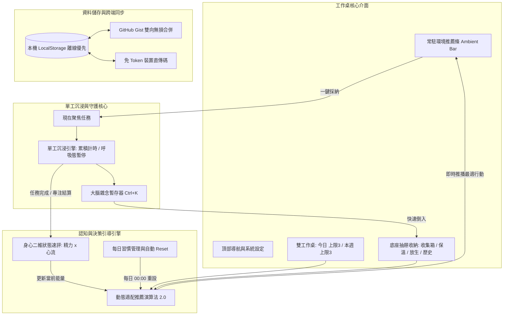

# Task Desk (個人任務工作桌)

> 一個低壓力、高專注的個人任務工作桌與單工沉浸引擎。  
> 拒絕假性生產力拖延，將零散想法快速倒入抽屜，並在單一焦點下平穩推進真正重要的事情。

[](https://github.com/Annie04082020/TaskDesk/releases/latest)
[](LICENSE)
[](https://github.com/Annie04082020/TaskDesk)

詳細完整教學請參閱：[詳細使用說明書 (USER_GUIDE.md)](./USER_GUIDE.md)

---

## 系統架構總覽 (System Architecture)



---

## 核心設計理念與優勢

1. **實體工作桌隱喻 (Physical Desk Metaphor)**：工作桌面絕不堆積成百上千條清單。只留「今天」與「本週」能消化的限量卡片，其餘項目一律歸入底座抽屜。
2. **單工沉浸優先 (Single-Tasking Engine)**：點擊「現在做這個」即啟動全頁沉浸模式，自動遮蔽並封鎖工作桌其餘卡片的編輯與切換，阻斷在待辦清單中來回整理的假性生產力拖延。
3. **工作桌常駐環境推薦條 (Ambient Dynamic Suggestion Bar)**：首頁工作桌上方常駐極簡推薦條，系統結合生理時鐘、死線迫近度與身心能量，自動推算最合適的下一步，不必手動開啟彈窗即可一鍵聚焦或切換。
4. **每日習慣動態浮出與自動 Reset (Dynamic Routines Engine)**：根絕傳統待辦清單「每日習慣看習慣了導致無視」的弊病。平時收納於待命庫不佔用桌面，當身心狀態或時段契合時自動以休整推薦浮出；每日跨日（凌晨 00:00）自動重設完成狀態。
5. **身心二維狀態速評回饋 (2D Energy & Flow Check-in)**：開工時與完成任務後提供輕量一擊速評（精力充沛/疲憊 x 心流順暢/卡關），即時動態校正工作桌推薦策略。
6. **工作記憶保護機制 (Working Memory Protection)**：
   * **呼吸態接關便籤**：暫停時留下「等一下回來第一步要做什麼」，降低重新啟動的切換阻力。
   * **大腦雜念暫存器 (`Ctrl/Cmd + K`)**：專注心流中閃現的瑣事一秒存入收集箱，不中斷當前任務。
7. **後台工時與認知分析儀表板 (Focus & Workload Analytics)**：獨立後台數據中心，追蹤四象限時間投資比、生理開工時段、中斷結構與接關筆記歷史，支援一鍵匯出 CSV / JSON。
8. **極簡單色美學 (Monochrome Distraction-Free UI)**：純文字高對比排版，全面移除彩色圖標與表情符號，使大腦視覺刺激降至最低。
9. **完全離線優先與隱私安全 (Local-First Privacy)**：零第三方雲端儲存、零追蹤器、支援本機 PIN 碼加密鎖定、系統設定內建 GitHub Gist 雙向同步與裝置直傳碼。

---

## 核心功能亮點

### 1. 雙工作桌容量防爆限制 (Dual Workbench Limits)
* **今日工作桌 (Today)**：消化當天具體行動，預設小任務限額 3 件，防止大腦超載。
* **本週工作桌 (Week)**：推進本週核心專案，預設中/大任務限額 3 件。
* **卡片尺寸階梯**：試水溫 (5-10m)、小 (15-30m)、中 (1-2h)、大 (2h+)。

### 2. 工作桌常駐環境推薦條 (Ambient Suggestion Bar)
* 位於工作桌頂端，即時顯示最適行動預覽與推薦理由。
* 提供「聚焦現在」、「換一個」與「收起」按鈕，零決策成本，完全保留使用者自主權。
* 頂部能量標籤可隨時點擊切換當前身心狀態。

### 3. 每日習慣庫管理 (Daily Routines)
* 支援建立每日運動、伸展、閱讀等微型生活習慣。
* 支援設定浮出偏好（疲憊休整時、精力充沛時、傍晚時、任意時）。
* 每日凌晨 00:00 自動清空完成註記，重設為今日待命。

### 4. 任務後二維狀態速評 (Post-Task Check-in)
* 完成主任務或結束專注時，底部滑出極輕量狀態卡片。
* 四象限身心能量矩陣：
  * **充沛 · 順暢**：腦力充沛，乘勝追擊攻克重大專注。
  * **充沛 · 卡關**：體力充足但思緒微卡，推薦切換動手做或運動習慣。
  * **疲憊 · 順暢**：手感良好但已略感疲態，適合整理與行政收尾。
  * **疲憊 · 卡關**：心力交瘁，推薦 5 分鐘伸展休整或試水溫微任務。
* 支援點擊右上角關閉或略過，絕不卡死心流。

### 5. 底座實體抽屜系統 (Desk Drawers)
工作桌下方設有可隨時拉開檢視的 4 格抽屜：
* **收集箱 (Inbox)**：靈感沉澱池，支援多行批次快速貼上。
* **保溫夾 (Keep)**：保留追蹤但這週不急著啟動的事項。
* **放生池 (Release)**：目前評估不執行或暫停的項目，移出注意力範圍。
* **歷史檔案庫 (History)**：已完成卡片自動按週別封存歸類，永不遺失，支援復原與 Markdown 週報匯出。

### 6. 單工沉浸引擎 (Single-Tasking Immersion Engine)
* **全頁沉浸遮罩**：鎖定外部卡片互動，只專注於單一主任務。
* **呼吸態暫停 (Graceful Pause)**：專注中斷時溫和過渡，輸入接關便籤以保留思維切入點。
* **全域閃念盒 (`Ctrl+K`)**：任何時刻快速傾倒腦中突發念頭進收集箱。
* **零羞恥退場診斷**：遇阻力時溫和退場（任務過大拆解、能量告急延後、自覺退出），已投入時間完整計入分析。

### 7. 專注與工時分析儀表板 (Focus Analytics Dashboard)
位於右上角「桌上工具 -> 專注與工時分析」的專屬後台：
* **總覽 (Overview)**：總時數、沉浸次數、平均時長、每日工時長條圖、生理開工時段分佈。
* **意圖分佈 (Intent)**：四象限時間投資比 (Q1-Q4)、任務類型配置比例、任務尺寸分佈。
* **摩擦力診斷 (Friction)**：中斷原因結構、智能溫和回饋引導、工作記憶接關簿回顧。
* **日誌明細 (Logs)**：流水帳紀錄、單筆刪除、一鍵 CSV / JSON 完整匯出。

### 8. 艾森豪四象限矩陣與結構化子任務匯入
* **客觀自動推估**：依據「任務尺寸 × 死線迫近程度」客觀分配象限（Q1 緊急重要、Q2 核心深耕、Q3 瑣事速辦、Q4 餘裕順手）。
* **結構化子任務批次匯入**：純文字貼上支援縮排（Tab 或空格）自動解析建立子任務；支援 Google Tasks Takeout JSON 檔案結構化匯入並還原母子層級。

### 9. 多端同步與安全防護
* **系統設定內建同步管理**：直接在「系統設定」面板進入跨裝置同步，解決導航摩擦。
* **GitHub Gist 私人同步**：透過 Personal Access Token 實現無伺服器雲端雙向合併。
* **裝置代碼直傳**：免 Token 複製 Base64 代碼，跨設備即時合併。
* **本機 PIN 碼鎖定**：原生 Web Crypto SHA-256 單向雜湊，公用設備防窺。

---

## 鍵盤快捷鍵

| 快捷鍵 | 作用範圍 | 說明 |
| :--- | :--- | :--- |
| **Ctrl + Enter** / **Cmd + Enter** | 頂部收集箱 | 快速儲存任務至收集箱 |
| **Ctrl + K** / **Cmd + K** | 全域任何畫面 | 開啟／收合 大腦雜念暫存器 (Brain Dump) |
| **Escape** | 全域任何畫面 | 關閉開啟中的彈窗、抽屜、狀態卡或暫存盒返回主工作桌 |
| **Enter** | 雜念暫存器 | 送出雜念並自動關閉暫存盒 |

---

## 本地開發與建置

本專案採用純前端靜態架構，無繁複建置流程：

### 1. 啟動本機伺服器
```bash
# 使用 Python 內建伺服器
python -m http.server 8080

# 或使用 Node.js
npx serve .
```
開啟瀏覽器前往 `http://localhost:8080` 即可使用。

### 2. 同步靜態資源至 Android 目錄
```bash
node build.js
```

### 3. 建置 Android APK (Capacitor)
```bash
# 安裝相依套件
npm install

# 同步資源至 Android 專案
npx cap sync android

# 編譯 Debug APK
cd android
./gradlew assembleDebug
```
編譯完成的 APK 位於：`android/app/build/outputs/apk/debug/app-debug.apk`。

---

## 專注守護系統 (Focus Guardian)

### 電腦端擴充功能 (Chrome / Edge Extension)
* **跨分頁網站攔截**：專注啟動時自動阻擋 YouTube、Bilibili、社群媒體等干擾網站。
* **背景免凍結計時**：獨立 Service Worker 執行緒與真實時間戳記差值，切換視窗寫作業工時絕不中斷漏計。
* **安裝方式**：至 `chrome://extensions` 或 `edge://extensions` 開啟開發者模式，載入專案中之 `extension/` 目錄。

### 手機端守護服務 (Android Mobile Focus Guardian)
* **原生無障礙即時攔截**：開工專注時自動覆蓋攔截 YouTube、Instagram、TikTok、Threads、Twitter 等分心 App。
* **深呼吸彈性通行通道 (Friction Pass)**：遇臨時查資料需求，提供 5 秒冷卻倒數後放行 3 分鐘，杜絕逆反。
* **低功耗與隱私**：僅監聽視窗變更事件，不讀取螢幕內容文字，零後台額外耗電。

---

## 授權條款

本專案基於 [MIT License](LICENSE) 開源授權發布。
