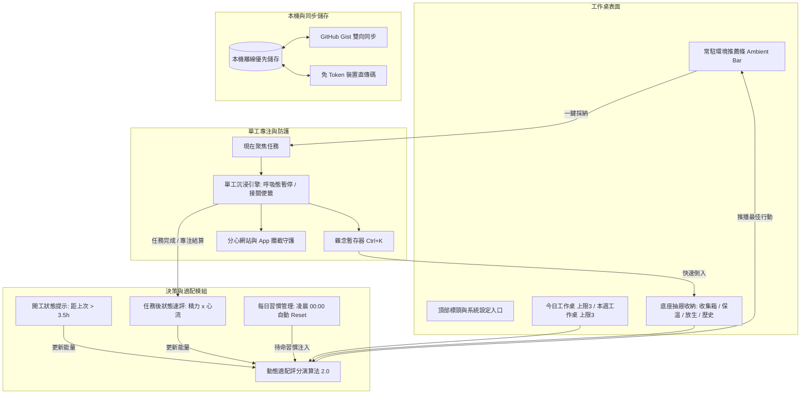

# Task Desk 個人任務工作桌 —— 詳細使用說明書 (User Manual)

歡迎使用 Task Desk（個人任務工作桌）。這是一套專為個人打造的低壓力、高專注單工任務管理與工時分析系統。

本手冊詳細說明 Task Desk 的核心設計理念、操作流程、單工專注引擎的使用技巧、後台數據分析方法、每日習慣管理以及跨裝置同步機制。

---

## 目錄

1. [核心架構與工作桌哲學](#1-核心架構與工作桌哲學)
2. [系統細部架構 (System Flowchart)](#2-系統細部架構-system-flowchart)
3. [快速入門：基本工作流程](#3-快速入門基本工作流程)
4. [任務輸入、縮排子任務與抽屜系統](#4-任務輸入縮排子任務與抽屜系統)
5. [每日習慣庫與動態浮出機制](#5-每日習慣庫與動態浮出機制)
6. [身心二維狀態速評與常駐環境推薦條](#6-身心二維狀態速評與常駐環境推薦條)
7. [單工沉浸專注引擎 (Single-Tasking Engine)](#7-單工沉浸專注引擎-single-tasking-engine)
8. [四象限矩陣與隱形死線](#8-四象限矩陣與隱形死線)
9. [後台專注與工時分析儀表板](#9-後台專注與工時分析儀表板)
10. [歷史檔案庫與週報匯出](#10-歷史檔案庫與週報匯出)
11. [跨裝置同步與資料安全性](#11-跨裝置同步與資料安全性)
12. [Android App 與防分心守護系統](#12-android-app-與防分心守護系統)
13. [鍵盤快捷鍵一覽](#13-鍵盤快捷鍵一覽)
14. [常見問題與排解 (FAQ)](#14-常見問題與排解-faq)

---

## 1. 核心架構與工作桌哲學

傳統待辦清單常因無窮無盡的任務列表給大腦帶來清單破產的焦慮感，甚至讓人陷入「花很多時間整理標籤、卻遲遲無法開工」的假性生產力拖延。Task Desk 依據以下核心理念設計：

* **實體工作桌隱喻**：辦公桌面上不該堆積數百份文件。Task Desk 將視野限制在當下「今天」與「本週」能消化的限額內，其餘事項一律收入底座抽屜。
* **單工沉浸優先**：開工時只專注眼前單一焦點任務，遮蔽其餘卡片的操作干擾，避免跳轉於多個視窗與待辦之間。
* **動態浮出習慣，拒絕習慣性忽視**：每日重複任務（如運動、伸展）平時收納於待命庫，時機成熟才主動浮出推薦，每日凌晨自動重設。
* **正向工時累積**：採用正向計時累積實打實投入的時間，沒有倒數計時即將歸零的急促警報壓力。
* **工作記憶保護**：暫停時留下接關便籤，專注中冒出的雜念使用快速鍵隨手拋入收集箱，確保思緒流暢不中斷。
* **純粹單色極簡美學**：全站無彩色圖示與表情符號，採用暗色高對比字級層次，大幅減輕視覺負擔與認知疲勞。

---

## 2. 系統細部架構 (System Flowchart)



---

## 3. 快速入門：基本工作流程

Task Desk 的推薦日常節奏非常簡潔：

```text
[ 傾倒雜念 ] -> [ 抽屜分流 ] -> [ 限制桌面 ] -> [ 啟動單工 ] -> [ 狀態速評 ] -> [ 復盤分析 ]
  收集箱輸入     今日 / 本週      限額容量防爆     專注沉浸       精力 x 心流     工時儀表板
```

1. **倒出雜念**：在頂部輸入框貼上或輸入想做的事（支援一次貼上多行或縮排子任務）。
2. **分流至抽屜**：新項目先存放於「收集箱」抽屜，不污染當前視線。
3. **佈置工作桌**：將 1~3 件最關鍵的事情推入「今日工作桌」或「本週工作桌」。
4. **選定焦點開工**：點擊常駐推薦條上的「聚焦現在」或卡片上的「現在」，進入沉浸專注態。
5. **打勾歸檔與速評**：完成後任務自動移入歷史庫，彈出極輕量狀態方塊更新當前精力，工時完整記錄於後台分析。

---

## 4. 任務輸入、縮排子任務與抽屜系統

### 4.1 頂部快速收集箱 (Capture Box)
* **批次輸入**：支援多行貼上，換行即自動拆分為獨立卡片。
* **縮排自動建立子步驟**：在文字行首加上 Tab 鍵或 2 個以上空格，系統自動將其掛載為上一行任務之 Micro 子任務。
* **習慣切換開關**：點擊收集箱的「習慣」按鈕，送出之項目自動轉為每日習慣，收納至習慣庫。
* **快捷鍵送出**：按下 `Ctrl + Enter`（Mac 為 `Cmd + Enter`）即可直接存入收集箱。
* **尺寸預選 (Size Selector)**：
  * **自動推估 (Auto)**：系統根據關鍵字自動判定耗時。
  * **試水溫 (5-10m)**：極小微步行動（例如：寫信主旨、開好檔案），啟動阻力最低。
  * **小 (15-30m)**：半小時內可完成的行動。
  * **中 (1-2h)**：需要一段完整時段推進的項目。
  * **大 (2h+)**：較大型專案或需要深度研讀的任務。
* **截止死線按鈕**：點擊可選擇日期，死線將在後台客觀加權。

### 4.2 桌面底座抽屜 (Desk Drawers)
工作桌底部提供 4 格實體抽屜底座，點擊即可向上滑出檢視：
1. **收集箱 (Inbox)**：靈感沉澱池。在此可為項目設定分類標籤、預估時間，或指派至今日/本週。
2. **保溫夾 (Keep)**：有價值但這週暫不執行的事情，收進此處定期回顧，不佔用本週心力。
3. **放生池 (Release)**：目前評估不想做、或過時的項目，放入放生池移出注意力。若日後需要隨時可復原。
4. **歷史檔案庫 (History)**：已完成事項的永久封存庫（依週別分類）。

### 4.3 雙工作桌容量防爆機制
* **今日工作桌 (Today)**：專注當天要消化的行動，預設小任務限額 3 件。
* **本週工作桌 (Week)**：掌控本週核心推進項目，預設中/大任務限額 3 件。
* 提示：容量上限可在「系統設定」中依個人工作型態自由調整。

---

## 5. 每日習慣庫與動態浮出機制

### 5.1 設計理念：根絕看板忽視疲勞
傳統待辦清單中將每日習慣（如運動、背單字）固定釘在清單上，容易產生「看習慣了等於沒看到」的無感現象。Task Desk 採「平時收納、時機契合才浮出」的原則：
* **每日習慣庫存**：習慣任務平時存於專屬習慣庫中，不佔用今日工作桌寶貴的 3 件限額。
* **每日自動重設 (Daily Auto-Reset)**：每天跨日（凌晨 00:00）或開工首次啟動時，系統自動將已完成習慣重設為「待命」狀態。
* **觸發時機設定**：
  * **疲憊/卡關時浮出**：作為高強度專注後的伸展、散步與轉換。
  * **精力充沛時浮出**：適合高強度體能訓練或深度晨讀。
  * **傍晚時浮出**：適合下班後的日常維護與整理。
  * **任意時段浮出**：隨機與其他任務一同參與狀態評分。

### 5.2 習慣管理視窗
透過右上角選單「桌上工具 -> 每日習慣庫」開啟，支援隨時新增習慣、手動標記今日完成、或一鍵將習慣移至今日工作桌立即執行。

---

## 6. 身心二維狀態速評與常駐環境推薦條

### 6.1 身心二維狀態速評 (2D Energy & Flow Check-in)
* **觸發時機**：
  1. 登入/開工時，若距上次填寫超過 3.5 小時，底部滑出問候卡片。
  2. 勾選完成任一主任務或結束專注時，底部滑出速評卡片。
  3. 隨時點擊工作桌頂部「狀態標籤」即可手動開啟。
* **四維矩陣選項**：
  * **充沛 · 順暢**：體力腦力充沛，手感順暢（推薦大中型核心專注）。
  * **充沛 · 卡關**：體力充足但思緒微卡（推薦動手做、換題目或運動習慣）。
  * **疲憊 · 順暢**：手感良好但已略感疲憊（推薦小任務收尾、行政整理）。
  * **疲憊 · 卡關**：心力交瘁（推薦 5 分鐘伸展休整或試水溫微任務）。
* **非阻塞設計**：支援點擊右上角叉號或按 ESC 立即略過，不干擾心流。

### 6.2 工作桌常駐環境推薦條 (Ambient Dynamic Suggestion Bar)
* **常駐工作桌頂部**：免去點擊按鈕開啟彈窗的摩擦力，直接提供最適建議。
* **操作按鈕**：
  * **聚焦現在**：一鍵將推薦項目設為當前專注（若為習慣則自動移入今日）。
  * **換一個**：依分數順位循環切換下一個合適的任務或習慣。
  * **收起**：點擊右上角叉號可暫時隱藏推薦條。

---

## 7. 單工沉浸專注引擎 (Single-Tasking Engine)

當您為某個任務點擊「現在」按鈕時，系統將自動啟動單工沉浸引擎：

### 7.1 全頁沉浸面板 (Immersion Overlay)
* 背景自動施加深色遮罩，物理封鎖工作桌其餘卡片的編輯、排序與拖曳互動，阻斷假性整理的拖延行為。
* 頂部顯示柔和呼吸指示與正向累積計時器。

### 7.2 呼吸態緩衝與接關便籤 (Graceful Pause & Resume Note)
* 專注過程中若需短暫離席或休息，點擊「暫停」按鈕進入呼吸緩衝態。
* **工作記憶接關簿**：暫停時填寫「等一下回來第一步要做什麼？」，返回時第一步驟立即映入眼簾，大幅降低重新啟動阻力。

### 7.3 全域大腦雜念暫存器 (Brain Dump)
* 專注時突然想起無關的事，按下快捷鍵 **`Ctrl + K`**（Mac 為 **`Cmd + K`**）。
* 輸入雜念並按 `Enter`，事項直接存入收集箱，暫存盒隨即收合，專注心流不受打擾。

### 7.4 零羞恥退場診斷 (Graceful Abort)
* 遇阻力時溫和退場（任務過大拆解、能量告急延後、自覺退出），已投入時間完整計入分析，避免心理挫折。

---

## 8. 四象限矩陣與隱形死線

### 8.1 客觀自動分流
系統依「任務尺寸 × 死線迫近程度」客觀計算四象限，無需自行苦惱輕重緩急：
* **Q1 迫在眉睫**：大中型任務且死線在今天至兩天內。
* **Q2 核心深耕**：大中型任務但死線尚有餘裕，個人成長與關鍵目標所在。
* **Q3 瑣事速辦**：小型或試水溫任務，死線較近需快速消化。
* **Q4 順手雜項**：小型雜務或無迫切死線事項。

### 8.2 隱形死線哲學
主介面卡片不顯示死線倒數文字，維持乾淨清爽的工作桌面，消除倒數壓力；死線僅在後台供演算法與象限分類計算權重。

---

## 9. 後台專注與工時分析儀表板

透過「桌上工具 -> 專注與工時分析」開啟專屬後台：
* **總覽 (Overview)**：總時數、沉浸次數、平均時長、每日工時長條圖、開工時段分佈。
* **意圖分佈 (Intent)**：四象限時間投資比 (Q1-Q4)、任務類型配置比例、任務尺寸分佈。
* **摩擦力診斷 (Friction)**：中斷原因結構、智能溫和回饋引導、工作記憶接關簿回顧。
* **日誌明細 (Logs)**：流水帳紀錄、單筆刪除、一鍵 CSV / JSON 完整匯出。

---

## 10. 歷史檔案庫與週報匯出

* 完成的任務自動按完成日期對應之週別進行封存。
* 隨時可自歷史抽屜點選「復原」將卡片移回工作桌。
* 支援一鍵匯出結構化 Markdown 週報與 JSON 存檔。

---

## 11. 跨裝置同步與資料安全性

### 11.1 系統設定直通同步面板
「系統設定」內已直接整合「跨裝置同步面板」入口按鈕，方便隨時進行設定。

### 11.2 GitHub Gist 私人同步
* 填入具備 `gist` 權限之 Personal Access Token，即可與個人私密 Gist 進行雙向無損合併。

### 11.3 免 Token 裝置直傳碼
* 在電腦端點選「複製同步碼」，在手機端點選「貼上同步碼」，即可免金鑰跨設備即時對齊最新進度。

### 11.4 完全離線與安全隱私
* 100% 資料本機儲存於 `LocalStorage`，無第三方追蹤器。
* 支援本機 PIN 碼鎖定工作桌，公用設備防窺。

---

## 12. Android App 與防分心守護系統

### 12.1 原生 APK 下載
* 隨時至專案 GitHub Releases 下載最新 APK 安裝。

### 12.2 手機端無障礙守護服務
* 透過系統「無障礙服務 (AccessibilityService)」啟用守護。
* 專注時自動覆蓋攔截 YouTube、Instagram、TikTok、Threads、Twitter 等分心 App。
* 具備 5 秒深呼吸冷卻通行通道 (Friction Pass)，查資料放行 3 分鐘，杜絕極端逆反心理。

---

## 13. 鍵盤快捷鍵一覽

| 快捷鍵 | 作用範圍 | 說明 |
| :--- | :--- | :--- |
| **Ctrl + Enter** / **Cmd + Enter** | 頂部收集箱 | 快速儲存任務至收集箱 |
| **Ctrl + K** / **Cmd + K** | 全域任何畫面 | 開啟／收合 大腦雜念暫存器 (Brain Dump) |
| **Escape** | 全域任何畫面 | 關閉開啟中的彈窗、抽屜、狀態速評卡或暫存盒返回主畫面 |
| **Enter** | 雜念暫存器 | 送出雜念並自動關閉暫存盒 |

---

## 14. 常見問題與排解 (FAQ)

**問：習慣任務每天完成後，隔天會自動清空打勾嗎？**  
答：是的。系統會在每日跨日（凌晨 00:00）或開工啟動時，自動將已完成習慣重設為「待命」狀態，無需手動取消勾選。

**問：為什麼主工作桌找不到我剛建的習慣？**  
答：每日習慣平時收納於「每日習慣庫」中，避免佔用今日工作桌 3 件限額造成無視疲勞。當身心能量或時段契合時，會自動出現在頂部「常駐推薦條」；您也可以隨時從「桌上工具 -> 每日習慣庫」手動叫出。

**問：在系統設定中找不到跨裝置同步？**  
答：已在「系統設定」面板直接加入「開啟跨裝置同步面板」快捷按鈕，點擊即可開啟 Gist 設定與同步碼傳遞工具。

**問：如何備份我的資料？**  
答：隨時至「系統設定 -> 資料備份與還原」點擊「匯出備份 JSON」即可保存完整任務與設定。
